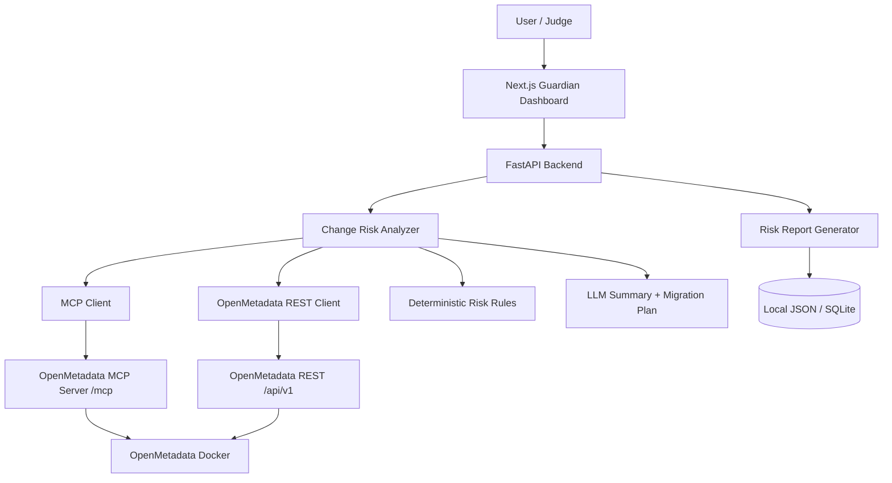

# Autonomous Data Guardian

Autonomous Data Guardian is a full-stack MVP that analyzes metadata change risk before changes break downstream dashboards, pipelines, and governance controls.

It combines:
- `frontend` (Next.js) for analyst workflow and report UI
- `guardian-backend` (FastAPI) for deterministic risk scoring, OpenMetadata integration, and CSV import workflow
- OpenMetadata (external service, usually via Docker) as metadata source of truth
- OpenRouter (optional) for LLM explanations and migration recommendations

## What This Project Does

- Search OpenMetadata table assets (`/assets/search`)
- Analyze user intent and schema-change risk (`/analyze-change`)
- Persist and render risk reports (`/reports/{id}`)
- Upload CSV, run AI review, and import into local DB + OpenMetadata (`/csv/analyze`, `/csv/import`)
- Fallback safely when OpenRouter is rate-limited

## Tech Stack and Tooling

- **Frontend**
  - Next.js `16.x`, React `19.x`, TypeScript
  - TailwindCSS + shadcn UI
- **Backend**
  - FastAPI, Pydantic Settings, HTTPX, Uvicorn
  - Local JSON report store + SQLite for CSV import storage
- **Metadata Platform**
  - OpenMetadata REST API and MCP API
- **LLM**
  - OpenRouter API (default free model + optional paid model)
- **Testing**
  - Pytest (backend)

## Overall Architecture



## Prerequisites

- Linux/macOS/WSL2
- Python `3.11+`
- Node.js `20+` and npm
- Docker + Docker Compose plugin

## 1) Clone and Install Dependencies

From repository root:

```bash
# Backend
python3 -m venv .venv
source .venv/bin/activate
pip install --upgrade pip
pip install -e guardian-backend

# Optional: dev/test tools
pip install -e "guardian-backend[dev]"

# Frontend
cd frontend
npm install
cd ..
```

## 2) Install and Run OpenMetadata with Docker

This repo does not include a local `docker-compose.yml` for OpenMetadata, so use the official deployment from OpenMetadata docs.

### Option A (recommended): official quickstart compose

1. Download OpenMetadata Docker quickstart files from official docs:
   - [OpenMetadata Docker Deployment](https://docs.open-metadata.org/latest/deployment/docker)
2. Start stack from that folder:

```bash
docker compose up -d
```

### Option B: pre-pull required images (faster first boot)

Example (version is illustrative; align with your chosen OpenMetadata release):

```bash
docker pull openmetadata/server:1.10.0
docker pull openmetadata/ingestion:1.10.0
docker pull postgres:13
docker pull elasticsearch:8.11.4
```

### Verify OpenMetadata

- UI: `http://localhost:8585`
- API health (example):

```bash
curl -s http://localhost:8585/api/v1/system/version
```

## 3) Environment Setup

Create `guardian-backend/.env`:

```bash
# Core app
GUARDIAN_APP_NAME=Autonomous Data Guardian API
GUARDIAN_FRONTEND_ORIGIN=http://localhost:3000

# OpenMetadata
GUARDIAN_OPENMETADATA_BASE_URL=http://localhost:8585
GUARDIAN_OPENMETADATA_MCP_URL=http://localhost:8585/mcp
GUARDIAN_OPENMETADATA_JWT_TOKEN=

# Report storage
GUARDIAN_REPORT_STORE_PATH=reports.json

# LLM / OpenRouter
GUARDIAN_LLM_ENABLED=true
GUARDIAN_OPENROUTER_BASE_URL=https://openrouter.ai/api/v1
GUARDIAN_OPENROUTER_API_KEY=your_key_here
GUARDIAN_OPENROUTER_MODEL=google/gemma-4-31b-it:free
GUARDIAN_OPENROUTER_MAX_RETRIES_PER_KEY=2
GUARDIAN_OPENROUTER_BASE_BACKOFF_SECONDS=0.8
GUARDIAN_OPENROUTER_MAX_TOKENS=220

# Optional key pool (for failover under 429)
GUARDIAN_OPENROUTER_API_KEY_2=
GUARDIAN_OPENROUTER_API_KEY_3=
GUARDIAN_OPENROUTER_API_KEY_4=

# CSV import workflow
GUARDIAN_CSV_IMPORT_MAX_FILE_SIZE_BYTES=5000000
GUARDIAN_CSV_IMPORT_DATABASE_URL=sqlite:///data/csv_imports.db
GUARDIAN_CSV_IMPORT_OPENMETADATA_DATABASE_SCHEMA_FQN=guardian.guardian-db.guardian
```

Create `frontend/.env.local`:

```bash
NEXT_PUBLIC_GUARDIAN_API_URL=http://localhost:8000
```

## 4) Run the Project

From repo root:

```bash
# Terminal 1: backend
source .venv/bin/activate
cd guardian-backend
uvicorn app.main:app --reload --port 8000

# Terminal 2: frontend
cd frontend
npm run dev
```

Open:
- Frontend: `http://localhost:3000`
- Backend health: `http://localhost:8000/health`

## 5) OpenRouter Free Rate Limit vs Paid Model

### Free model mode (default)

- Default model is:
  - `google/gemma-4-31b-it:free`
- Pros:
  - No paid usage
- Cons:
  - More frequent `429` rate-limit responses during heavy retries

### Rate-limit handling in this project

Backend `OpenRouterClient` supports:
- Multiple API key failover (`GUARDIAN_OPENROUTER_API_KEY`, `_2`, `_3`, `_4`)
- Retry per key (`GUARDIAN_OPENROUTER_MAX_RETRIES_PER_KEY`)
- Backoff (`GUARDIAN_OPENROUTER_BASE_BACKOFF_SECONDS`)

If all retries fail, the backend returns deterministic fallback planning behavior in analysis flow.

### Paid model mode (recommended for stable usage)

Use any paid OpenRouter model slug, for example:

```bash
GUARDIAN_OPENROUTER_MODEL=openai/gpt-4o-mini
```

Then restart backend.  
Benefit: lower probability of rate-limit interruption during peak usage.

## 6) Import Sample CSV into OpenMetadata

You can import CSV from UI (`/upload`) or API.

### UI flow

1. Open `http://localhost:3000/upload`
2. Upload a sample CSV (for example from `plan/*.csv`)
3. Enter intent
4. Click **Analyze**
5. Confirm `tableName` + `databaseSchemaFqn`
6. Click **Import to DB + OpenMetadata**

### API flow

Analyze:

```bash
curl -X POST "http://localhost:8000/csv/analyze" \
  -F "file=@/absolute/path/to/your.csv" \
  -F "intent=Analyze this CSV before import"
```

Import:

```bash
curl -X POST "http://localhost:8000/csv/import" \
  -H "Content-Type: application/json" \
  -d '{
    "analysisId":"<analysis-id>",
    "tableName":"market_prices",
    "databaseSchemaFqn":"guardian.guardian-db.guardian",
    "overwriteExistingTable":true
  }'
```

## 7) Key API Endpoints

- `GET /health`
- `GET /assets/search?q=<keyword>`
- `POST /analyze-change`
- `GET /reports/{report_id}`
- `POST /csv/analyze`
- `POST /csv/import`

## 8) Troubleshooting

- **OpenMetadata connection error**
  - Check `GUARDIAN_OPENMETADATA_BASE_URL` and that Docker stack is up.
- **MCP unavailable**
  - Ensure `GUARDIAN_OPENMETADATA_MCP_URL` is correct.
  - Backend still supports partial analysis from REST context when MCP enrichment fails.
- **OpenRouter 429 / rate limit**
  - Add more API keys and keep retries/backoff enabled.
  - For more stable behavior, move to paid model.
- **CORS error from frontend**
  - Set `GUARDIAN_FRONTEND_ORIGIN=http://localhost:3000`.
- **CSV import fails**
  - Verify `databaseSchemaFqn` and OpenMetadata connectivity.
  - Confirm file size under `GUARDIAN_CSV_IMPORT_MAX_FILE_SIZE_BYTES`.

## 9) Development and Tests

```bash
source .venv/bin/activate
cd guardian-backend
python -m pytest
```

---

## Security Notes

- Never commit real API keys or tokens to git.
- Keep `.env` local/private.
- Prefer scoped OpenRouter/OpenMetadata credentials for development.
